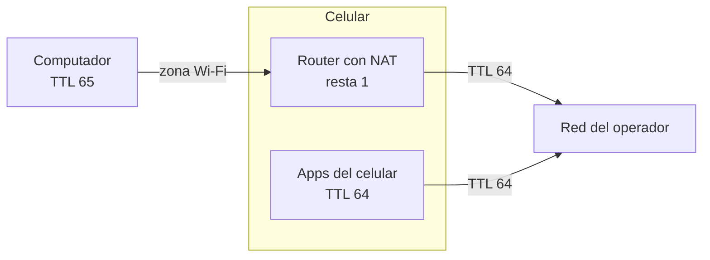
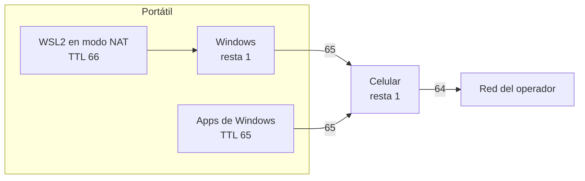

# Compartir datos del celular con el computador en Colombia: por qué el operador lo nota y cómo ajustar el TTL

Por [Jovanny Medina Cifuentes](#sobre-el-autor) · Analista de Sistemas y Desarrollador de Software · Cali, Colombia

Programaba con fibra óptica y me pasaba lo clásico: «en mi computador funciona bien». Pero mis clientes se quejaban de lentitud. Entonces empecé a programar con los datos del celular, compartidos al portátil. Desde entonces, la experiencia de mis clientes queda bajo control mientras escribo el programa: la lentitud la noto yo antes que ellos.

Compartir los datos del celular con el computador tiene un detalle: el operador puede distinguir los datos que usa el celular de los que usa el computador conectado a él, y hay planes con un cupo aparte para compartir. Esta guía explica en palabras sencillas cómo lo nota y, paso a paso, cómo ajustar el valor que lo delata —el **TTL** en IPv4 y el **Hop Limit** en IPv6— cuando compartes datos por zona Wi-Fi, punto de acceso, *hotspot* o *tethering* (en iPhone se llama [«Compartir Internet»](https://support.apple.com/es-co/111785)). Cubre Windows 10 y 11, Linux y WSL2.

> **En corto:** el operador puede notar que compartes datos por el TTL, un número que lleva cada paquete. El celular sale a internet con TTL 64 y le resta 1 a todo lo que reenvía; si el computador sale con 65, a la red del operador le llega 64 desde los dos.

## ¿Para qué ajustar el TTL al compartir datos?

Para que el tráfico del computador llegue a la red del operador con el mismo TTL que el del celular, y ese valor ya no lo delate como uso compartido.

En Colombia, los planes pospago «ilimitados» suelen serlo para el uso del propio celular, pero fijan un cupo aparte para compartir datos con otros equipos: en 2026, [Selectra](https://selectra.com.co/internet-hogar/portatil) (actualizado el 23/04/2026) reporta un tope de 100 GB mensuales para el uso compartido en Claro, Movistar, Tigo y ETB. Para aplicar ese cupo, el operador tiene que distinguir el tráfico del celular del de los equipos conectados a él, y una de las señales más simples es el TTL.

El ajuste sirve para trabajar desde el portátil con los datos del celular: teletrabajo, viajes, lugares sin conexión fija o, como en mi caso, programar con datos móviles para notar la lentitud antes que los clientes.

Antes de hacerlo, lee [qué no hace](#qué-no-hace) y [qué dice la ley en Colombia](#qué-dice-la-ley-en-colombia).

## ¿Cómo nota el operador que estoy compartiendo datos?

Una de las señales más simples es el TTL, un contador que lleva cada paquete de datos. El celular le resta 1 a todo lo que reenvía desde el computador, así que ese tráfico llega a la red del operador con un valor distinto al del propio celular.

Piénsalo como un cupo de escalas. Cada paquete sale con un cupo, y cada equipo que lo reenvía le gasta una escala. El celular les da 64 a sus paquetes, y con 64 llegan a la red del operador. Los del portátil pasan antes por el celular, que les gasta una: llegan con 63 si el portátil usa Linux, que también da 64, o con 127 si usa Windows, que da 128. Ese número delata que hubo otro equipo. Si el portátil da 65, sus paquetes llegan con 64, igual que los del celular.

En términos técnicos, cada paquete IP lleva un contador de saltos: el **TTL** en IPv4 ([RFC 791](https://www.rfc-editor.org/rfc/rfc791)) y el **Hop Limit** en IPv6 ([RFC 8200](https://www.rfc-editor.org/rfc/rfc8200)). El sistema operativo le pone un valor inicial y cada router que reenvía el paquete le resta 1. En la zona Wi-Fi, el celular es un router con NAT: a todo lo que llega del computador le resta 1 antes de mandarlo a la red del operador.

| Sistema | TTL inicial por defecto |
|---|---|
| Android, iOS, Linux y macOS | 64 |
| Windows | 128 |

Por eso el operador ve valores distintos según de dónde salió el paquete:

| Origen del paquete | Sale con | Llega a la red del operador con |
|---|---|---|
| El celular | 64 | 64 |
| Windows, por la zona Wi-Fi | 128 | **127**: se nota que es compartido |
| Linux, por la zona Wi-Fi | 64 | **63**: se nota que es compartido |
| Windows o Linux con TTL 65 | 65 | 64: igual que el celular |



## ¿Qué valor de TTL usar?

**65** si el computador se conecta directo a la zona Wi-Fi del celular, y **66** si hay otro router en medio: por ejemplo, dentro de WSL2 en modo NAT, donde Windows hace de router. La regla:

**TTL del equipo = 64 + número de routers entre el equipo y la red del operador.** El celular cuenta como uno.

| Equipo | Routers hasta el operador | TTL |
|---|---|---|
| Windows o Linux conectado directo a la zona Wi-Fi | 1: el celular | 65 |
| WSL2 en modo `mirrored` | 1: el celular | 65 |
| WSL2 en modo NAT, el predeterminado | 2: Windows y el celular | 66 |
| Equipo detrás de otro router conectado al celular | 2 | 66 |



Son valores típicos. Para confirmarlos, cuenta los routers: manda un paquete con TTL 1 y mira qué IP responde que el TTL expiró (*Time to live exceeded* en Linux, *TTL expired in transit* en Windows). Esa IP es el primer router.

```bash
ping -c1 -t1 1.1.1.1      # Linux y WSL2
ping -n 1 -i 1 1.1.1.1    # Windows
```

Si responde el celular —en iPhone, `172.20.10.1`; en general, la puerta de enlace que muestran `ip route` o `ipconfig`—, no hay nada en medio y el valor es 65. Si responde otra IP, sube el TTL de prueba de a uno (`-t2`, `-t3`…) hasta que responda el celular: cada router antes de él suma 1 al valor.

## ¿Cómo cambiar el TTL en Windows 10 y 11?

Con dos comandos, uno para IPv4 y otro para IPv6, en PowerShell o CMD **como administrador**:

```powershell
netsh int ipv4 set glob defaultcurhoplimit=65
netsh int ipv6 set glob defaultcurhoplimit=65
```

- Aplica de inmediato y sobrevive al reinicio: `netsh` escribe por defecto en el almacén persistente (`netsh int ipv4 set global /?`: *persistent: Set is persistent. This is the default.*).
- Las interfaces con `CurrentHopLimit` en 0 heredan este valor global. Para verlo: `Get-NetIPInterface | Format-Table InterfaceAlias,AddressFamily,CurrentHopLimit`.
- Para volver al valor original, usa los mismos comandos con `defaultcurhoplimit=128`.

## ¿Cómo cambiar el TTL en Linux y WSL2?

Linux maneja dos valores: `net.ipv4.ip_default_ttl` para IPv4 y `hop_limit` por interfaz para IPv6 ([documentación del kernel](https://docs.kernel.org/networking/ip-sysctl.html)). Este archivo fija los dos: `all`, `default` —la plantilla de las interfaces que se creen después— y, con el comodín, cada interfaz que ya existe.

```bash
sudo tee /etc/sysctl.d/99-ttl.conf >/dev/null <<'EOF'
# TTL de salida: IPv4 (ip_default_ttl) e IPv6 (hop_limit)
net.ipv4.ip_default_ttl=65
net.ipv6.conf.all.hop_limit=65
net.ipv6.conf.default.hop_limit=65
net.ipv6.conf.*.hop_limit=65
EOF
sudo /usr/lib/systemd/systemd-sysctl /etc/sysctl.d/99-ttl.conf
```

- El último comando lo aplica de inmediato. Al arrancar lo vuelve a aplicar el servicio `systemd-sysctl`, y la regla de udev de systemd lo aplica a cada interfaz nueva.
- Para volver al valor original, borra el archivo y reinicia: el kernel vuelve a 64.

### WSL2

- Necesita systemd para que el archivo se aplique al arrancar. En `/etc/wsl.conf`:

  ```ini
  [boot]
  systemd=true
  ```

- El valor depende del modo de red: `wslinfo --networking-mode` responde `nat` o `mirrored`. El modo `mirrored` se activa con `networkingMode=mirrored` en la sección `[wsl2]` de `%UserProfile%\.wslconfig`, en Windows 11 22H2 o superior ([documentación de Microsoft](https://learn.microsoft.com/es-es/windows/wsl/networking)).
- Windows y WSL2 fijan su TTL por separado: cambiar uno no cambia el otro, porque cada sistema arma sus propios paquetes.

## ¿Cómo comprobar que quedó bien?

Con tres pruebas: el valor configurado, que el sistema lo use y que el celular salga con 64.

| Qué | Windows | Linux y WSL2 |
|---|---|---|
| Valor configurado | `netsh int ipv4 show glob` y `netsh int ipv6 show glob` | `cat /proc/sys/net/ipv4/ip_default_ttl` y `grep . /proc/sys/net/ipv6/conf/*/hop_limit` |
| El sistema lo usa | `ping -n 1 127.0.0.1` → `TTL=65` | `ping -c1 127.0.0.1` y `ping -c1 ::1` → `ttl=65` |
| El celular sale con 64 | `ping -n 1 172.20.10.1` → `TTL=64` | `ping -c1 172.20.10.1` → `ttl=64` |

En IPv6, el router de la red puede anunciar su propio Hop Limit (campo *Cur Hop Limit*, [RFC 4861](https://www.rfc-editor.org/rfc/rfc4861)). Por eso conviene verificar con el equipo ya conectado a la zona Wi-Fi.

## ¿Qué no hace?

- **No regala datos.** El volumen se sigue contando en tu plan; lo único que cambia es que el TTL no delata al computador.
- **No es la única señal.** El operador también puede reconocer el uso compartido por otros rasgos del tráfico —los dominios y cabeceras propios de cada sistema operativo, como los de las actualizaciones de Windows—, por el APN que usa el celular para compartir o por la configuración del operador en el celular.
- **No cambia tu contrato.** El cupo para compartir y los usos permitidos los fijan los términos y condiciones de tu plan: léelos.
- **No cambia los paquetes con TTL propio.** Las aplicaciones que fijan su propio TTL, como `traceroute`, no usan el valor por defecto.

## ¿Qué dice la ley en Colombia?

- **[Ley 1450 de 2011, artículo 56](https://gestornormativo.creg.gov.co/gestor/entorno/docs/ley_1450_2011.htm) (Neutralidad en Internet), numeral 2**, sobre los prestadores del servicio de Internet: «No podrán limitar el derecho de un usuario a incorporar o utilizar cualquier clase de instrumentos, dispositivos o aparatos en la red, siempre que sean legales y que los mismos no dañen o perjudiquen la red o la calidad del servicio».
- **[Corte Constitucional, Sentencia C-206 de 2025](https://mobiletime.la/noticias/30/05/2025/neutralidad-de-la-red-colombia/).** Declaró inexequible el aparte del mismo artículo que permitía a los prestadores hacer ofertas según los perfiles de uso y consumo de sus usuarios, con efectos diferidos un año desde la publicación de la sentencia. Su efecto más visible es el fin de las aplicaciones «gratis» (*zero rating*).
- **[Resolución CRC 5050 de 2016, Título II, Capítulo 9](https://normograma.crcom.gov.co/crc/compilacion/rcdlcr5d2_tabla_contenido_resolucion_compilatoria_comision_regulacion_comunicaciones_resolucion_5050_2016.html) (Neutralidad en Internet).** Es la regulación de la CRC que desarrolla ese artículo: principios (art. 2.9.1.3), prácticas de gestión de tráfico (art. 2.9.2.4) e información sobre los planes de acceso a Internet (art. 2.9.3.1).

Esto no es asesoría legal: ante una duda sobre tu plan, la referencia son sus términos y condiciones.

## Sobre el autor

**Jovanny Medina Cifuentes** es Analista de Sistemas y Desarrollador de Software en Cali, Colombia, y desarrolla software para empresas desde el año 2000. Trabaja con dos miradas: como analista, entiende qué pasa y por qué; como desarrollador, decide dónde y cómo resolverlo, y lo comprueba donde lo usan sus clientes, no solo en su computador. Por eso esta guía tiene dos niveles: arriba se entiende sin saber de redes y abajo están los comandos para comprobar cada valor.

Más sobre su trabajo en [Jovanny.CO](https://www.jovanny.co).

---

Licencia [CC BY 4.0](LICENSE): puedes compartir y adaptar este contenido, incluso con fines comerciales, dando crédito al [autor](#sobre-el-autor). Los datos para citarlo están en [`CITATION.cff`](CITATION.cff).
